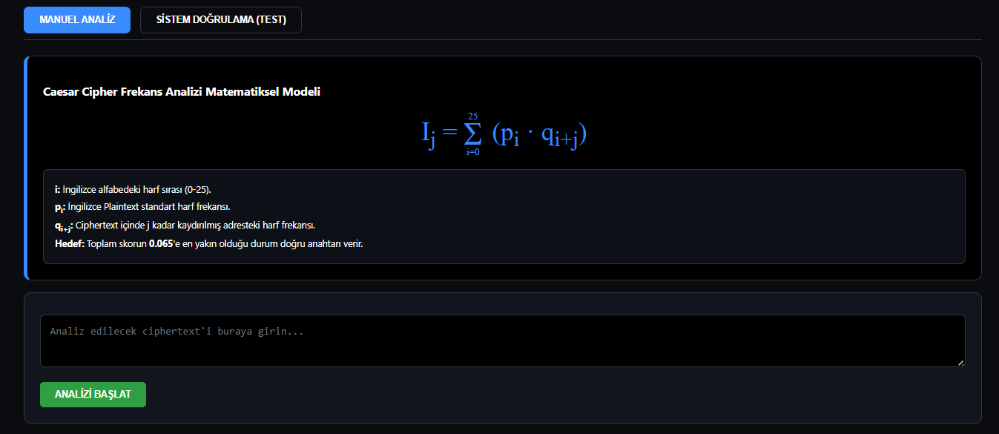
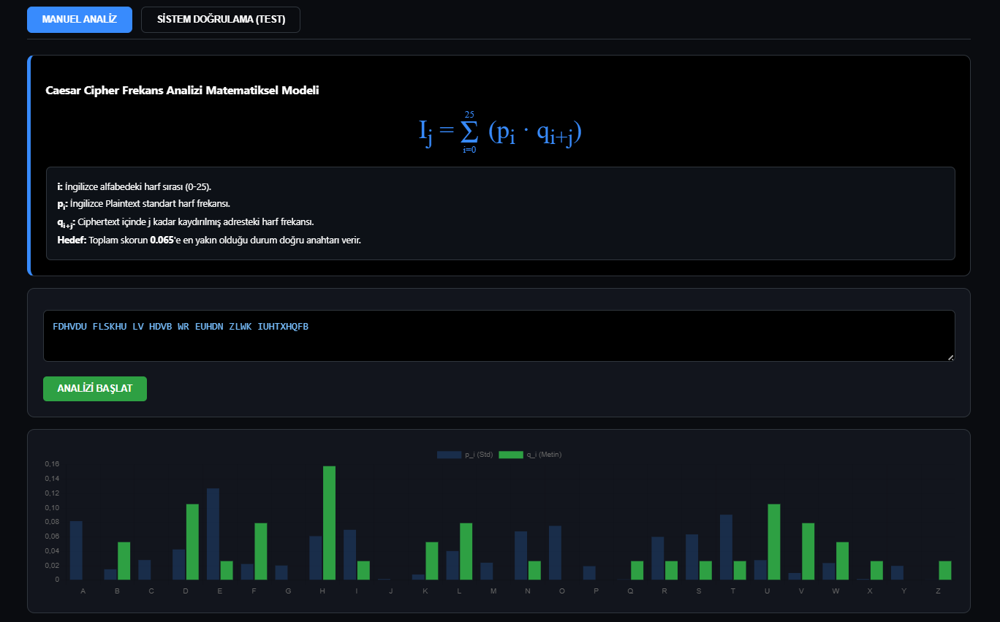
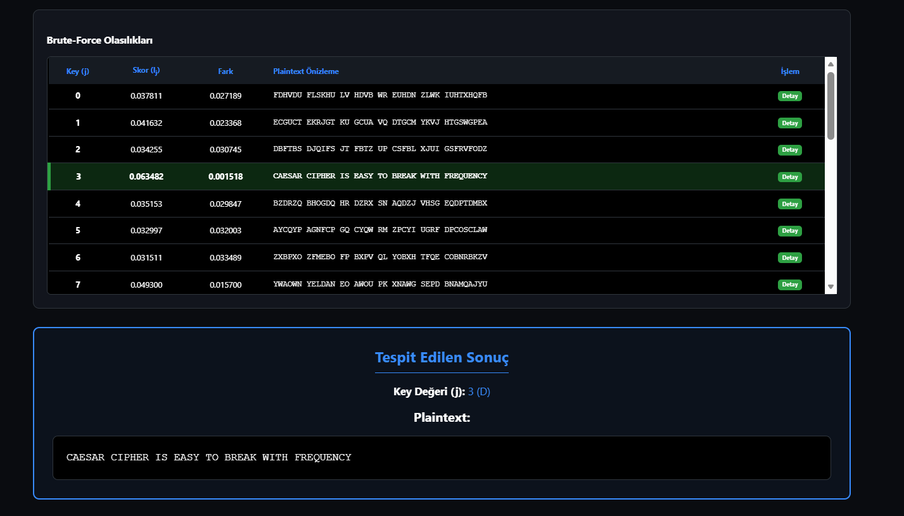

# Frekans Analizi ile Klasik Şifre Kırma Aracı

Bu proje, **Caesar Cipher** ile şifrelenmiş İngilizce metinleri brute-force ve frekans analizi yöntemleriyle çözmek amacıyla geliştirilmiştir.

Proje iki farklı uygulamadan oluşmaktadır:

- Python tabanlı komut satırı uygulaması
- HTML, CSS ve JavaScript ile geliştirilen web tabanlı görsel analiz uygulaması

Web uygulaması, `0–25` arasındaki bütün Caesar anahtarlarını deneyerek her anahtar için plaintext adayı ve frekans analizi skoru üretir. Hesaplanan skorun `0.065` değerine uzaklığı karşılaştırılır ve en küçük farka sahip anahtar en uygun anahtar olarak seçilir.

## Ekran Görüntüleri

### Manuel Analiz Ekranı

Kullanıcı, Caesar Cipher ile şifrelenmiş metni giriş alanına yazar ve analizi başlatır.



### Harf Frekanslarının Karşılaştırılması

Şifreli metinden elde edilen harf frekansları, standart İngilizce harf frekanslarıyla grafik üzerinde karşılaştırılır.



### Brute-Force ve Analiz Sonucu

Tüm anahtarlar için hesaplanan skorlar, fark değerleri ve plaintext adayları tablo hâlinde gösterilir. En uygun anahtar otomatik olarak vurgulanır.



## Özellikler

- Caesar Cipher ile şifrelenmiş metinleri analiz etme
- `0–25` arasındaki bütün anahtarları deneme
- Her anahtar için plaintext adayı oluşturma
- Ciphertext içerisindeki harf frekanslarını hesaplama
- Standart İngilizce harf frekanslarıyla karşılaştırma
- Her anahtar için matematiksel skor hesaplama
- Skorun `0.065` değerine uzaklığını bulma
- En uygun anahtarı otomatik olarak belirleme
- Harf frekanslarını grafik üzerinde gösterme
- Brute-force sonuçlarını tablo hâlinde listeleme
- Her anahtarın ayrıntılı matematiksel hesabını görüntüleme
- Hazır test senaryolarıyla sistemi doğrulama
- Python CLI üzerinden Caesar analizi yapma
- Frekans eşleştirmesiyle tahmini substitution analizi yapma

## Matematiksel Model

### Caesar Şifreleme

Caesar şifrelemesinde plaintext içerisindeki her harf, anahtar değeri kadar ileri kaydırılır.

$$
C_i = (P_i + k) \bmod 26
$$

Burada:

- $P_i$: Plaintext karakterinin sayısal değeri
- $C_i$: Ciphertext karakterinin sayısal değeri
- $k$: Şifreleme anahtarı
- $26$: İngilizce alfabedeki harf sayısı

### Caesar Şifre Çözme

Şifre çözme işleminde ciphertext karakterinden anahtar değeri çıkarılır.

$$
P_i = (C_i - k) \bmod 26
$$

### Frekans Analizi Skoru

Her anahtar değeri için aşağıdaki frekans analizi skoru hesaplanır:

$$
I_j = \sum_{i=0}^{25} p_i \cdot q_{(i+j)\bmod 26}
$$

Burada:

- $I_j$: `j` anahtarı için hesaplanan frekans analizi skoru
- $p_i$: İngilizce dilinde `i`. harfin standart görülme olasılığı
- $q_i$: Ciphertext içerisinde `i`. harfin gözlenen frekansı
- $j$: Denenen Caesar anahtarı
- $i$: İngilizce alfabedeki harf indisi (`0–25`)

İngilizce doğal metinlerde frekans eşleşme değeri yaklaşık olarak `0.065` civarındadır.

Bu nedenle her anahtar için aşağıdaki fark hesaplanır:

$$
D_j = |I_j - 0.065|
$$

Doğru anahtar, bu farkı en küçük yapan anahtar olarak seçilir:

$$
j^* =
\underset{j \in \{0,\ldots,25\}}{\operatorname{argmin}}
\left|I_j - 0.065\right|
$$

Örneğin bir anahtar için:

```text
Ij = 0.063482
```

hesaplanırsa fark:

```text
|0.063482 - 0.065| = 0.001518
```

olur. Bütün anahtarlar arasında en küçük fark bu ise ilgili anahtar en uygun anahtar olarak kabul edilir.

## Çalışma Adımları

1. Kullanıcı ciphertext metnini girer.
2. Metin içerisindeki İngilizce harfler sayılır.
3. Her harfin metin içerisindeki frekansı hesaplanır.
4. `0–25` arasındaki bütün Caesar anahtarları denenir.
5. Her anahtar için plaintext adayı oluşturulur.
6. Her anahtarın frekans analizi skoru hesaplanır.
7. Skorun `0.065` değerine olan uzaklığı bulunur.
8. En küçük farka sahip anahtar seçilir.
9. Tespit edilen anahtar ve plaintext kullanıcıya gösterilir.

## Kullanılan Teknolojiler

### Web Uygulaması

- HTML5
- CSS3
- JavaScript
- Chart.js

### Komut Satırı Uygulaması

- Python
- `collections` kütüphanesi

## Proje Yapısı

```text
kriptoloji-frekans-analizi/
├── Python(CLI)/
│   └── kriptoloji_proje.py
├── Web_Uygulamasi/
│   ├── index.html
│   ├── style.css
│   └── script.js
├── gorseller/
│   ├── ana-ekran.png
│   ├── frekans-grafigi.png
│   └── analiz-sonucu.png
└── README.md
```

## Web Uygulamasını Çalıştırma

1. `Web_Uygulamasi` klasörünü açın.
2. `index.html` dosyasını bir web tarayıcısında çalıştırın.
3. Caesar Cipher ile şifrelenmiş İngilizce metni giriş alanına yazın.
4. `ANALİZİ BAŞLAT` butonuna tıklayın.
5. Frekans grafiğini, brute-force tablosunu ve tespit edilen sonucu inceleyin.
6. İstenilen anahtarın `Detay` butonuna basarak matematiksel hesaplamaları görüntüleyin.

Grafiklerin görüntülenebilmesi için Chart.js CDN bağlantısı nedeniyle internet bağlantısı gerekebilir.

## Python CLI Uygulamasını Çalıştırma

Terminali `Python(CLI)` klasöründe açın ve aşağıdaki komutu çalıştırın:

```bash
python kriptoloji_proje.py
```

Program içerisinde aşağıdaki seçenekler bulunmaktadır:

```text
1. Caesar kır
2. Substitution analiz
3. Testleri çalıştır
4. Çıkış
```

## Örnek Kullanım

Ciphertext:

```text
FDHVDU FLSKHU LV HDVB WR EUHDN ZLWK IUHTXHQFB
```

Tespit edilen anahtar:

```text
3
```

Plaintext:

```text
CAESAR CIPHER IS EASY TO BREAK WITH FREQUENCY
```

## Sistem Doğrulama

Web uygulamasında bulunan test ekranı sayesinde önceden belirlenmiş ciphertext, anahtar ve plaintext değerleri kullanılarak sistemin sonucu kontrol edilebilir.

Test başarılı olduğunda sistem, beklenen anahtarla bulunan anahtarın aynı olduğunu gösterir.

## Sınırlamalar

- Sistem standart İngilizce harf frekanslarını kullanmaktadır.
- Türkçe veya farklı dillerde doğru sonuç vermeyebilir.
- Çok kısa metinlerde yeterli istatistiksel veri oluşmadığı için yanlış anahtar seçilebilir.
- Vigenère gibi polialfabetik şifreleme yöntemleri desteklenmemektedir.
- Substitution analizi tahmini sonuç üretir ve her zaman tam çözüm sağlamayabilir.
- Noktalama işaretleri ve boşluklar analiz sırasında korunur ancak frekans hesabına dahil edilmez.

## Yazılım Geliştirme

**Emre Ayvaz**  
Python, HTML, CSS ve JavaScript